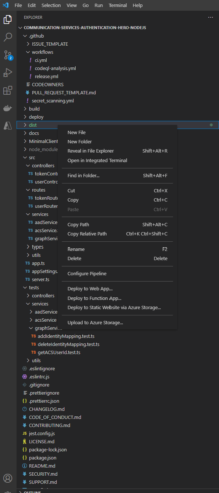

# Contribution Guides

1. **[Get Set up](<1. get-set-up.md>)**
2. **[Build Authentication Server Sample](<2. build-authentication-sample.md>)**
3. **[Run Authentication Server Sample](<3. run-authentication-sample.md>)**
4. **[Test Your Changes](<4. test-your-changes.md>)**
5. **[Write Unit Tests](<5. write-unit-tests.md>)**
6. **[Submit a PR](<6. submit-a-pr.md>)**
7. **[Publish Your Changes](<7. publish-your-changes.md>)**


## 7. Publish Your Changes

We recommend to use Visual Studio Code and Azure extension to publish your updates, so please login your Azure account in VS code before operating following steps.  

1. Run the command below, to clean the old `/dist` (if exists) and create a new one:

    ```bash
    npm run prod
    ```

2. Right click on the `/dist`, and select `Deploy to Web App...`




3. Please follow the instructions on the top bar

        a. Enter the name of app you want to create

        b. Choose the laungauge (Node 12 LTS or Node 14 LTS)

        c. Choose your price plan 

4. Then you can check the app on your Azure account, and update configuration values following **[Deploy & Test sample on Azure](<../deployment-guides/deploy-and-test-sample-on-azure.md>)**. 

---

- Previous: **[Submit a PR](<6. submit-a-pr.md>)**

