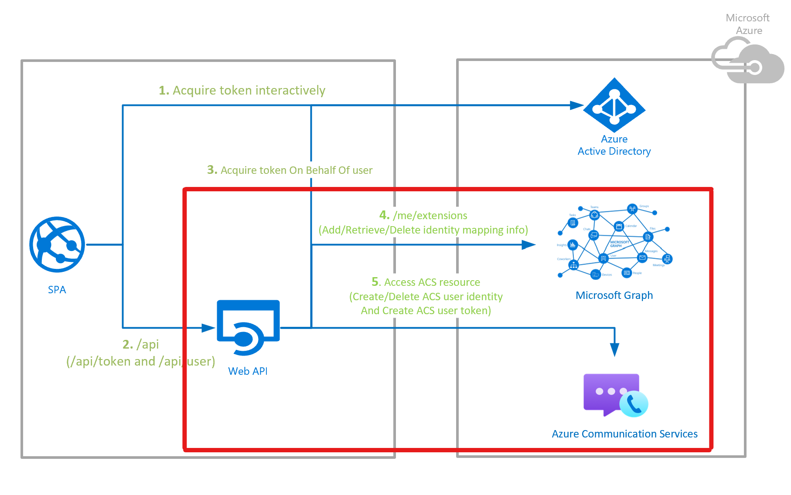
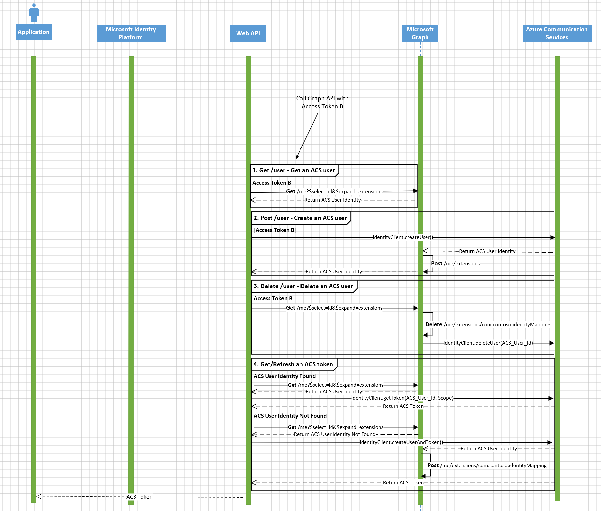

# Identity Mapping Design

## Table of content

- [Scenario](#scenario)
- [Overview](#overview)
- [The Way How to Manage](#the-way-how-to-manage)
  - [User Endpoint](#user-endpoint)
  - [Token Endpoint](#token-endpoint)
- [Contributing](#contributing)
- [More Information](#more-information)

## Scenario

Since Azure Communication Services is an identity-agnostic service, customers need to build trusted backend service that maintains the mapping relationship that their business case requires instead of duplicating information in their system. For example, they can map identities 1:1, 1:N, N:1, N:M.

>External identifiers such as phone numbers, users, devices, applications, and GUIDs can't be used for identity in Azure Communication Services. Access tokens that are generated for an Azure Communication Services identity are used to access primitives such as chat or calling. Know more, please visit [Azure Communication Services Identity Model](https://docs.microsoft.com/azure/communication-services/concepts/identity-model)

## Overview

This sample demonstrates how to utilize Microsoft Graph open extensions as the solution of identity mapping storage to build trusted backend service that will manage ACS identities by mapping them 1:1 with Azure Active Directory identities (for Teams Interop or native ACS calling/chat) and issue ACS tokens.

> Note: 
>
> 1. Developers should not use extensions to store sensitive personally identifiable information, such as account credentials, government identification numbers, cardholder data, financial account data, healthcare information, or sensitive background information.
> 2. Microsoft Graph has two Extension types: [Open extensions](https://docs.microsoft.com/graph/extensibility-overview#open-extensions) vs [Schema extensions](https://docs.microsoft.com/graph/extensibility-overview#schema-extensions) (**Untyped** data vs **Typed** data). The reason why we use the open extensions here is that we only store simple key-value mapping in this scenario, not typed data.
> 3. It is worth mentioning that maximum **2** **open extensions** are allowed per resource instance while **schema extensions** are **5**. Know more known issues, please visit [Known Extensions Limitations](https://docs.microsoft.com/graph/known-issues#extensions)



## The Way How to Manage

As displayed in the ACS Authentication Server - Identity Mapping sequence diagram below, the identity mapping part consists of two endpoints - `/api/user` and `/api/token`



### `/api/user` Endpoint

The `/api/user` endpoint consists of three operations:

1. **GET** - Retrieve the Azure Communication Services identity from Microsoft Graph.
2. **POST** - Add an identity mapping information in Microsoft Graph
3. **DELETE** - Delete an identity mapping information from Microsoft Graph as well as the Azure Communication Services reource.

#### ***GET*** /user

This endpoint is to get the Azure Communication Services identity by given Azure AD ID through Graph open extensions. If there is no related identity mapping stored previously, it will return an error message.

1. Get an Azure AD token exchanged via OBO flow.

2. Use the AAD token to retrieve the identity mapping information from Microsoft Graph by calling `/me?$select=id&$expand=extensions`.

   1. If there is an existing identity mapping information, then return

      ```json
      
      ```

   2. If not, then return an error message

      ```json
      
      ```

#### ***POST*** /user

This endpoint is to create a Communication Services identity and then add the roaming identity mapping information to the user resource through Graph open extensions. It will return an error message when failing to store the identity mapping information.

1. Get an Azure AD token exchanged via OBO flow.

2. Create a Communication Services identity using `createUser`.

   1. if successful, then use the AAD token to add the identity mapping information to the user resource through Graph open extensions by calling `/me/extensions`.

      1. If successful to store, then return

         ```json
         
         ```

      2. If failing to store, then return an error message

         ```json
         
         ```

   2. If not, then return an error message

      ```json
      
      ```

#### ***DELETE*** /user

This endpoint is to remove the identity mapping from the user's roaming profile information using Graph open extensions.

1. Get an Azure AD token exchanged via OBO flow.

2. Retrieve the Communication Services identity from Microsoft Graph.

   1. If successful to retrieve, delete the identity mapping information related to the retrieved identity from Microsoft Graph by calling `/me/extensions/<extensionName>`

      1. If successful to remove, delete the ACS user identity from Communication Services resource using `deleteUser` which revokes all active access tokens and prevents users from issuing access tokens for the identity. Also it will remove all the persisted content associated with the identity.

         1. If successful, then return

            ```json
            
            ```

         2. If not, then return an error message

            ```json
            
            ```

      2. If not, then return an error message

         ```json
         
         ```

   2. If not, then return an error message

      ```json
      
      ```

### `/api/token` Endpoint

The `/api/user` endpoint only consists of one operation - `GET` used to get and refresh Communication Services tokens

#### ***GET*** /token

When calling the endpoint, the first step is to check if there is an existing identity mapping information stored in Microsoft Graph. If not, a new Communication Services identity will be created and stored by this endpoint. Detailed process shows as follow:

1. Get an Azure AD token exchanged via OBO flow.

2. Retrieve the Communication Services identity from Microsoft Graph.

   1. If the identity mapping information exists, create a Communication Services token using `getToken`.

      ```json
      
      ```

   2. If no identity mapping information exists, create a Communication Services identity and token `createUserAndToken` first.

      1. If failing to create an ACS identity and token, then return an error message.

         ```json
         
         ```

      2. If not, then add the identity mapping information to the user resource using Graph open extensions.

         1. If successful to add, return the Azure Communication Services token to users.

            ```json
            
            ```

         2. If not, then return an error message.

            ```json
            
            ```

## Contributing

If you'd like to contribute to this sample, see [CONTRIBUTING.MD](../../CONTRIBUTING.md).

This project has adopted the [Microsoft Open Source Code of Conduct](https://opensource.microsoft.com/codeofconduct/). For more information, see the [Code of Conduct FAQ](https://opensource.microsoft.com/codeofconduct/faq/) or contact [opencode@microsoft.com](mailto:opencode@microsoft.com) with any additional questions or comments.

## More Information

For more information, visit the following links:

- To lean more about **Azure Communication Services - Identity**, visit:

  - [Quickstart: Create and manage access tokens](https://docs.microsoft.com/azure/communication-services/quickstarts/access-tokens?pivots=programming-language-javascript)
  - [Quickstart: Quickly create Azure Communication Services access tokens for testing](https://docs.microsoft.com/azure/communication-services/quickstarts/identity/quick-create-identity)
  - [Azure Communication Services Identity JavaScript SDK](https://azuresdkdocs.blob.core.windows.net/$web/javascript/azure-communication-identity/1.0.0/index.html)
- To learn more about **Microsoft Graph Open Extensions**: visit:
  - [Microsoft Graph Extensions Overview](https://docs.microsoft.com/graph/extensibility-overview)
  - [Add custom data to users using open extensions](https://docs.microsoft.com/graph/extensibility-open-users)
  - [Microsoft Graph Extensions Known Limitations](https://docs.microsoft.com/graph/known-issues#extensions)

