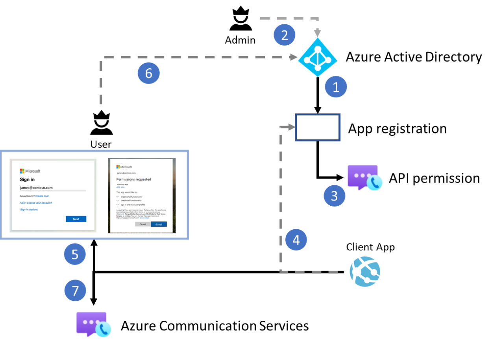

# Token Exchange Design

## Table of content

- [Scenario](#scenario)
- [Overview](#overview)
- [How Token Exchange Works](#how-token-exchange-works)
- [Contributing](#contributing)
- [More Information](#more-information)

## Scenario

As you may know, Azure Communication Services SDKs has the ability to allow developers to build custom applications that support Teams identities. These applications can communicate with the Microsoft Teams client or other custom applications utilizing the Azure Communication Services support for Teams identities. With the support for Teams identities, developers can customize a voice, video, chat, and screen-sharing experience for Teams users.

## Overview

In this Azure Communication Services Authentication Server sample, we would describe how developers can authenticate a Microsoft 365 user by using the Microsoft Authentication Library (MSAL) and retrieving a Microsoft Entra user token. They will then exchange that token for an access token of Teams user with the Azure Communication Services Identity SDK. The access token for Teams user can then be used by the Communication Services Calling SDK.
In a production environment, it's necessary that you implement this exchange mechanism in a back-end service, because requests for an exchange are signed with a secret.

## How Token Exchange Works

As displayed in the Azure Communication Services Authentication Server - Token Exchange flow diagram below, the **Token Exchange for single tenant** includes two steps:

1. From the **Client side**, the developer configures the Microsoft Authentication Library (MSAL) to authenticate the Microsoft 365 user using the client application registration that should have been created earlier using [application creation steps](../deployment-guides/set-up-app-registrations.md).  This client app registration should have Azure Communication Services **Teams.ManageCalls** and **Teams.ManageChats** permissions and these should have been **granted admin consent**, in order to obtain Microsoft Entra user tokens using **Authorization Code Grant flow**. The [MinimalClient](../../MinimalClient/README.md) added in the sample for testing the backend service APIs with UI, demonstrates the authentication flow using client app registration.
2. From the **Server side**, the developer initializes the **Azure Communication Services Identity SDK** and exchanges the incoming Microsoft Entra user token for the access token of Teams user via the identity SDK. The access token of Teams user is then returned to the client application. In the sample, the `/api/token/teams` implements the suggested server side logic.

## Contributing

If you'd like to contribute to this sample, see [CONTRIBUTING.MD](../../CONTRIBUTING.md).

This project has adopted the [Microsoft Open Source Code of Conduct](https://opensource.microsoft.com/codeofconduct/). For more information, see the [Code of Conduct FAQ](https://opensource.microsoft.com/codeofconduct/faq/) or contact [opencode@microsoft.com](mailto:opencode@microsoft.com) with any additional questions or comments.

## More Information

For more information, visit the following links:

- To learn more about the scenario, visit:
  - [Integrate communication as Teams user with Azure Communication Services and Graph API](https://docs.microsoft.com/azure/communication-services/concepts/teams-endpoint)
- To learn more about the Teams Access Token Management, visit:
  - [Quickstart: Set up and manage access tokens for Teams users](https://docs.microsoft.com/azure/communication-services/quickstarts/manage-teams-identity?pivots=programming-language-javascript)
